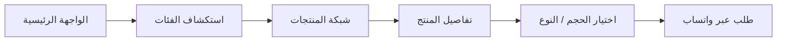

# YARAWIC — ياراويك


نسخة Home v0 عربية RTL لعلامة ياراويك، أعيد تصميمها بصريًا بأسلوب **Contemporary Arabic Pantry**. الموقع يعرض كتالوجًا تفاعليًا من بيانات محلية، ويقود الطلب إلى واتساب من دون حسابات أو دفع أو مخزون.

## Portfolio Proof

| البعد | الدليل |
|---|---|
| **المشكلة** | علامة منتجات محلية تحتاج كتالوجًا عربيًا واضحًا ومسار طلب منخفض الاحتكاك دون بناء متجر Backend كامل. |
| **الحل** | واجهة RTL ثابتة تعرض الفئات والمنتجات والخيارات وتحوّل الاختيار إلى رسالة طلب واتساب. |
| **الواجهة** | [index.html](client/index.html) |
| **منطق المنتجات والطلب** | [app.js](client/public/app.js) |
| **نظام العرض** | [styles.css](client/public/styles.css) |
| **النشر** | [GitHub Pages workflow](.github/workflows/deploy-pages.yml) |
| **الحالة الحالية** | المشروع مجهز لبناء ثابت ونشر GitHub Pages؛ لا توجد حسابات مستخدمين أو دفع أو إدارة مخزون مخفية. |


## Product Flow



## التشغيل المحلي

```bash
pnpm install --frozen-lockfile
pnpm dev:static
```

يستمع Vite على المنفذ 3000. لبناء الملفات الثابتة:

```bash
pnpm build:static
```

## ما تحتويه النسخة

- Hero تحريري غير مركزي بصور منتجات ياراويك الحقيقية.
- خط Readex Pro للعناوين والواجهة، وDM Mono للأرقام والأسعار، وكلاهما محفوظ محليًا.
- فهرس فئات وشبكة منتجات واضحة، مع نافذة تفاصيل وخيارات الحجم/النوع والسعر.
- رسالة طلب مرتبطة بالاختيار إلى واتساب.
- قسم مخمّر الملفوف، خطوات الطلب، التوصيل والاستلام، وروابط العلامة.
- `client/public/manus-routes.json` لمسار الصفحة الرئيسية.

## نطاق المشروع

يركز المشروع على تجربة كتالوج عربية RTL خفيفة وسريعة، مع عرض المنتجات وخياراتها ومسار طلب مباشر، دون إدخال نظام حسابات أو دفع أو إدارة مخزون معقد.

## النشر

المشروع مجهز للنشر على GitHub Pages عبر GitHub Actions عند كل تحديث على فرع `main`:

`https://mohammedalhmed.github.io/YARAWIC/`
