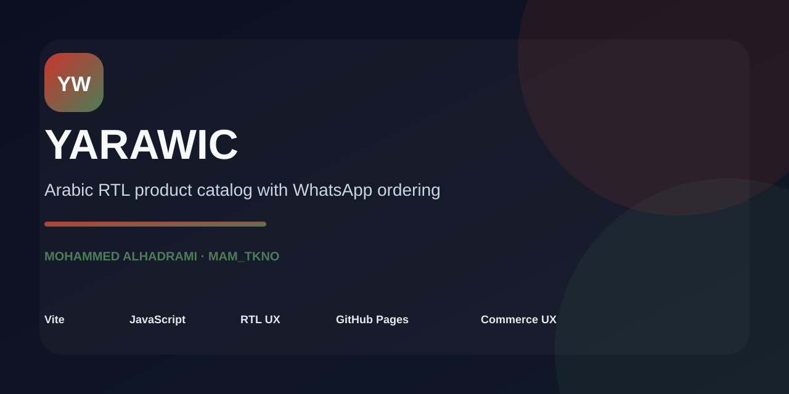
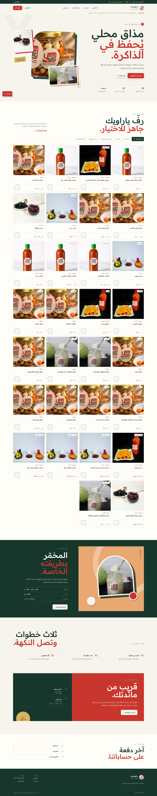
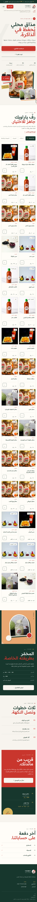
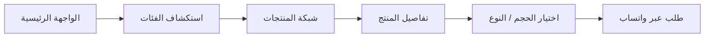
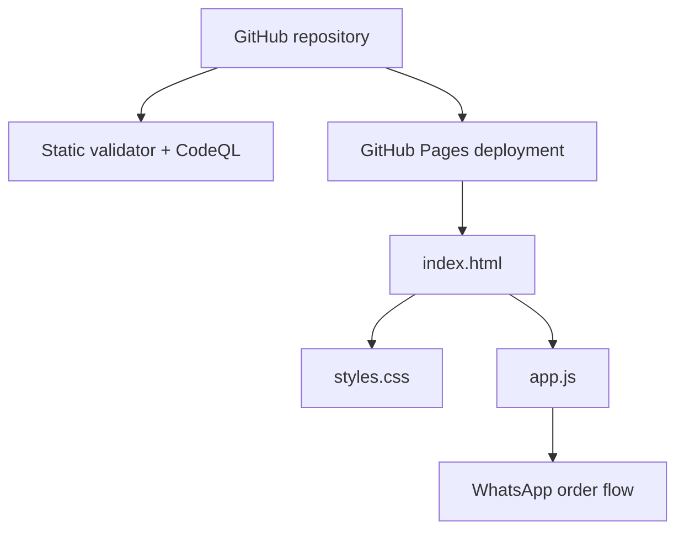

# YARAWIC — ياراويك




[](https://github.com/mohammedalhmed/YARAWIC/actions/workflows/deploy-pages.yml)

**Arabic-first RTL product catalog with lightweight WhatsApp ordering.**

[Live Demo](https://mohammedalhmed.github.io/YARAWIC/) · [Interface](client/index.html) · [Product Logic](client/public/app.js) · [Styles](client/public/styles.css) · [Deploy Workflow](.github/workflows/deploy-pages.yml)


كتالوج عربي RTL لعلامة **ياراويك**، مصمم بأسلوب Contemporary Arabic Pantry. يعرض المنتجات والفئات والأحجام والأسعار المنشورة، ثم يحوّل اختيار العميل إلى رسالة واتساب جاهزة دون حسابات أو دفع أو Backend غير ضروري.

## Screenshots

<p>
  
  
</p>

## Portfolio Proof

| البعد | الدليل |
|---|---|
| **المشكلة** | علامة منتجات محلية تحتاج كتالوجًا عربيًا واضحًا ومسار طلب منخفض الاحتكاك دون بناء متجر كامل. |
| **الحل** | HTML/CSS/JavaScript خفيف يعرض الفئات والمنتجات والخيارات ويحوّل الاختيار إلى رسالة طلب واتساب. |
| **الواجهة** | [client/index.html](client/index.html) |
| **منطق المنتجات والطلب** | [client/public/app.js](client/public/app.js) |
| **نظام العرض** | [client/public/styles.css](client/public/styles.css) |
| **التحقق الآلي** | [scripts/validate-static.mjs](scripts/validate-static.mjs) |
| **النشر** | [GitHub Pages workflow](.github/workflows/deploy-pages.yml) |
| **الحالة الحالية** | Static production app بلا قاعدة بيانات أو حسابات أو بوابة دفع مخفية. |

## Product Flow



## التشغيل المحلي

لا يحتاج المشروع إلى تثبيت dependencies:

```bash
npm run dev
```

ثم افتح:

```text
http://localhost:3000
```

للتحقق من الكتالوج والأصول وJavaScript:

```bash
npm run check
```

## ما تحتويه النسخة

- Hero تحريري بصور منتجات ياراويك الحقيقية.
- خط عربي ومحارف رقمية محفوظة محليًا لتقليل الاعتماد على خدمات خارجية.
- تصفية حسب الفئة وشبكة منتجات واضحة.
- نافذة تفاصيل قابلة للوصول بلوحة المفاتيح مع اختيار الحجم أو النوع.
- إنشاء رسالة طلب واتساب بحسب المنتج والخيار المحدد.
- قسم مخمّر الملفوف، خطوات الطلب، التوصيل والاستلام وروابط العلامة.
- Validator آلي يتأكد من IDs المنتجات، عدد المنتجات، ومسارات الأصول قبل الدمج.

## Architecture



لا توجد طبقة React أو Express أو قاعدة بيانات في مسار الإنتاج. هذا مقصود: نطاق المشروع كتالوج تسويقي سريع، وليس متجرًا كاملًا.

## النشر

يُنشر المشروع تلقائيًا على GitHub Pages عند كل تحديث لفرع `main`:

`https://mohammedalhmed.github.io/YARAWIC/`
